# Barcelona city data

Piecing together some AQ and cycle network data for a Barcelona study
trip.

# Air Quality

There are 8 air quality sites in Barcelona monitoring NO2 and PM, the
main vehicle pollutants of interest.

Two useful ways to use this data to gain insights into the effect of
sources is to combine the data with wind speed and direction and do a
“Polar Plot” from the openair R package. This essentially bins
concentrations onto a compass and shows what combination of conditions
had which concentrations.

This has been done for all sites and species as an average for the last
5 years on [an interactive
map](https://blaisekelly.github.io/barcelona_city_dat/maps/L5Y_polar_map.html)

The second is to meteorologically normalise the data and remove the
effect of the weather, which is in many cases a stronger influence on
local concentrations than sources themselves. This allows patterns from
sources to be more visible. This was done using the [mweather R package] (https://github.com/skgrange/rmweather).

## Sant Adria de Beso (Olimpic) es1148a 

### NO2

#### concentrations by wind direction and speed for last 5 years

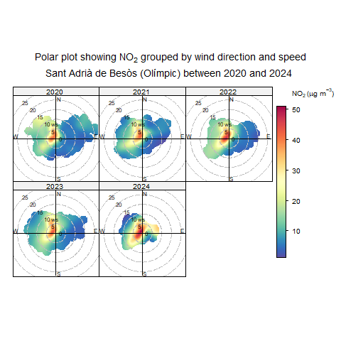

#### Normalised concentrations since monitor installed

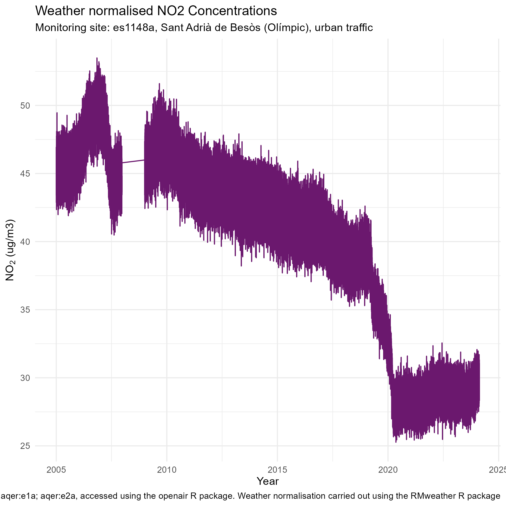

### PM10

#### concentrations by wind direction and speed for last 5 years

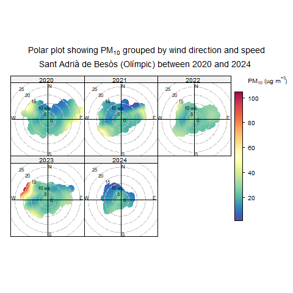

#### Normalised concentrations since monitor installed

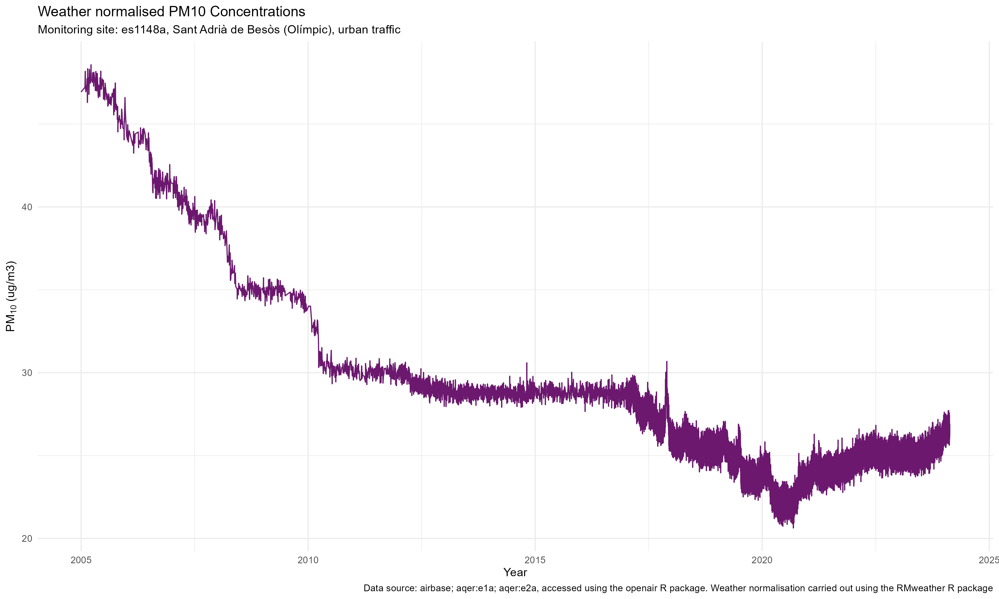

## Barcelon (I’Eixample) es1438a  

### NO2

#### concentrations by wind direction and speed for last 5 years

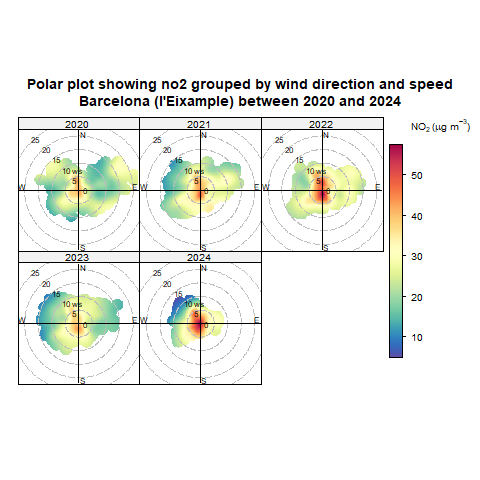

#### Normalised concentrations since monitor installed

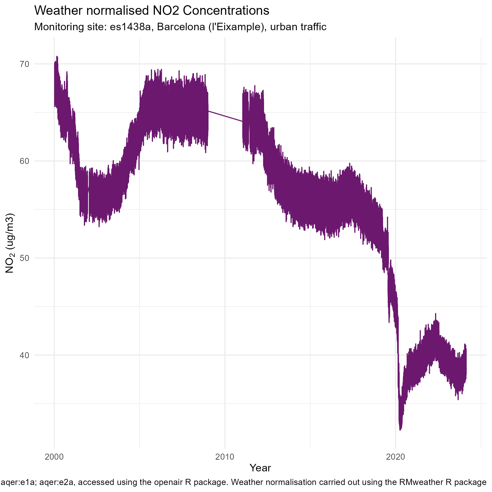

### PM10

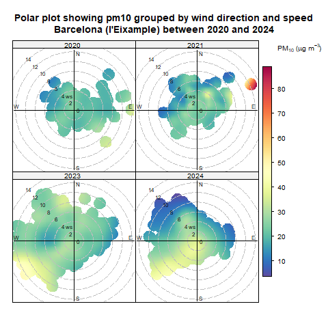

#### Normalised concentrations since monitor installed

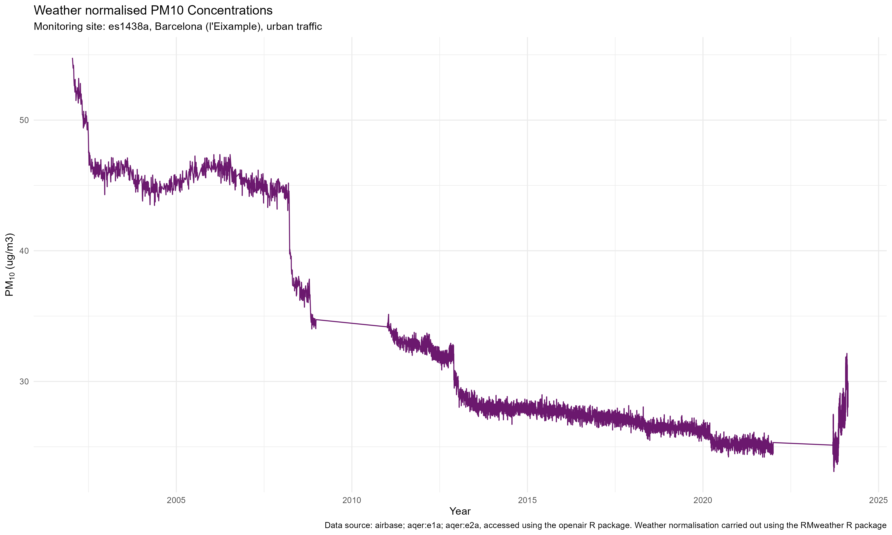

## Barcelona (Gracia - Sant Gervasi) es1480a

### NO2

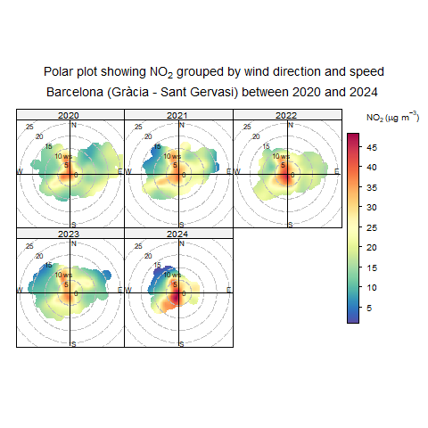

#### Normalised concentrations since monitor installed

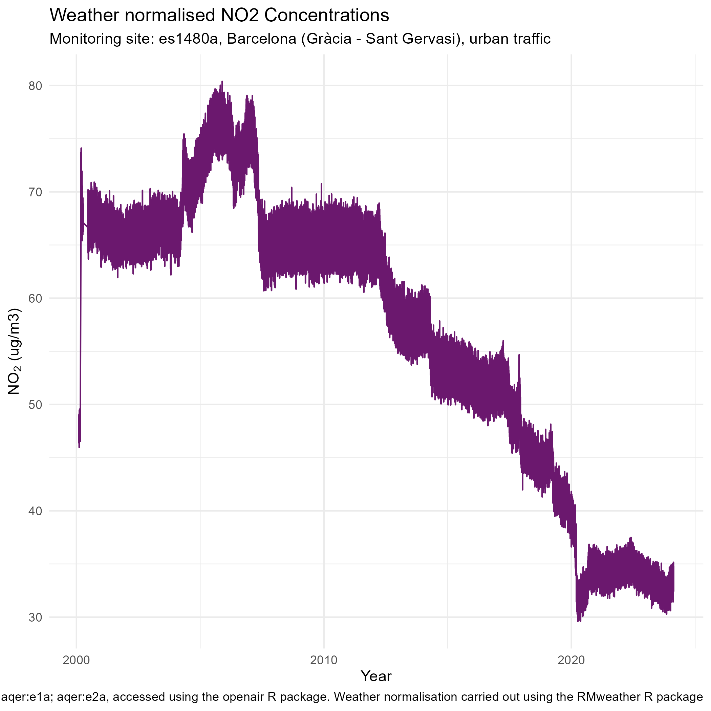

## PM10

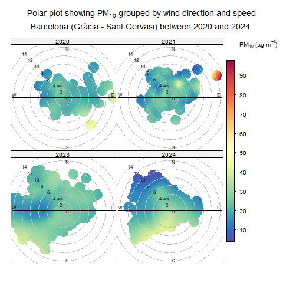

#### Normalised concentrations since monitor installed

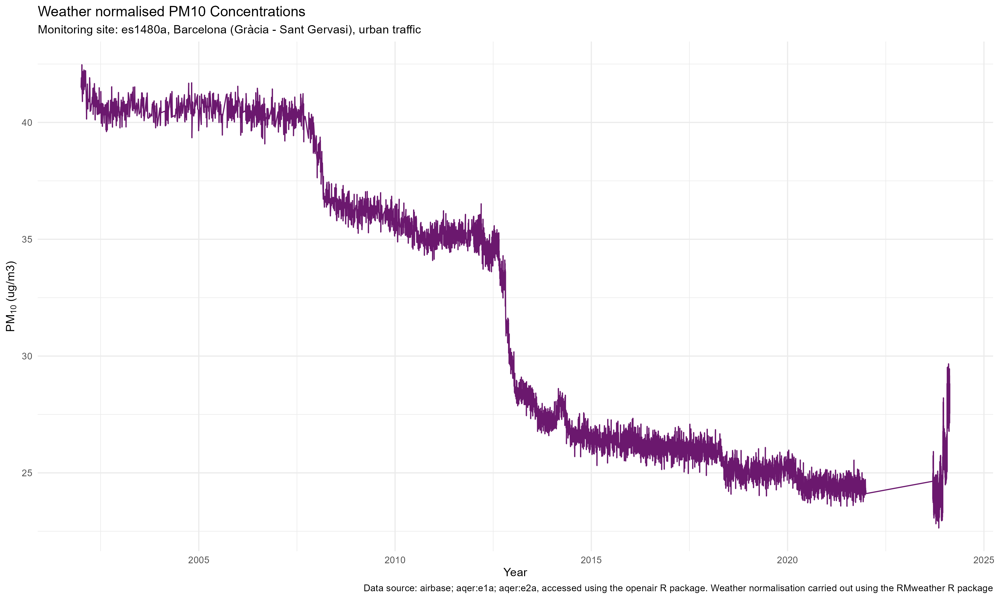 \## Barcelona (pl. de la Universitat)
es0559a

### PM10

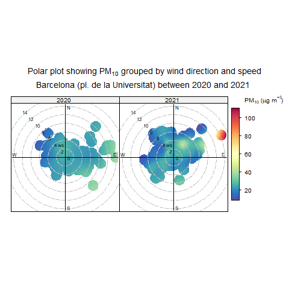

#### Normalised concentrations since monitor installed

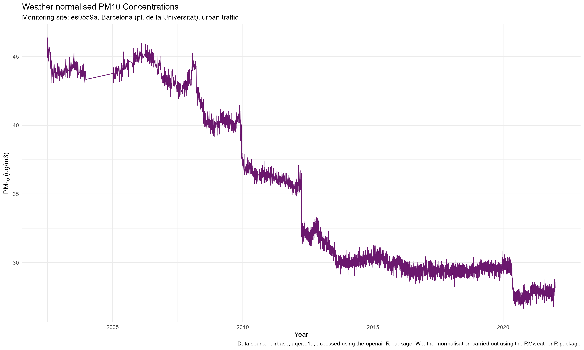

## I5 Badalona es0693a

### NO2

#### Normalised concentrations since monitor installed

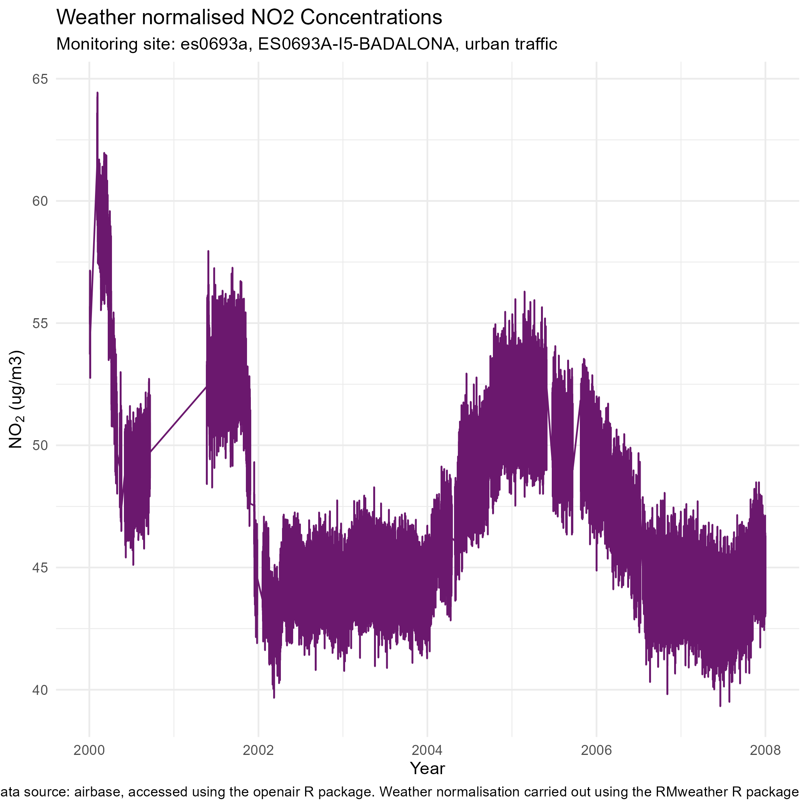

## IA Cornella es0695a

#### NO2

## Normalised concentrations since monitor installed

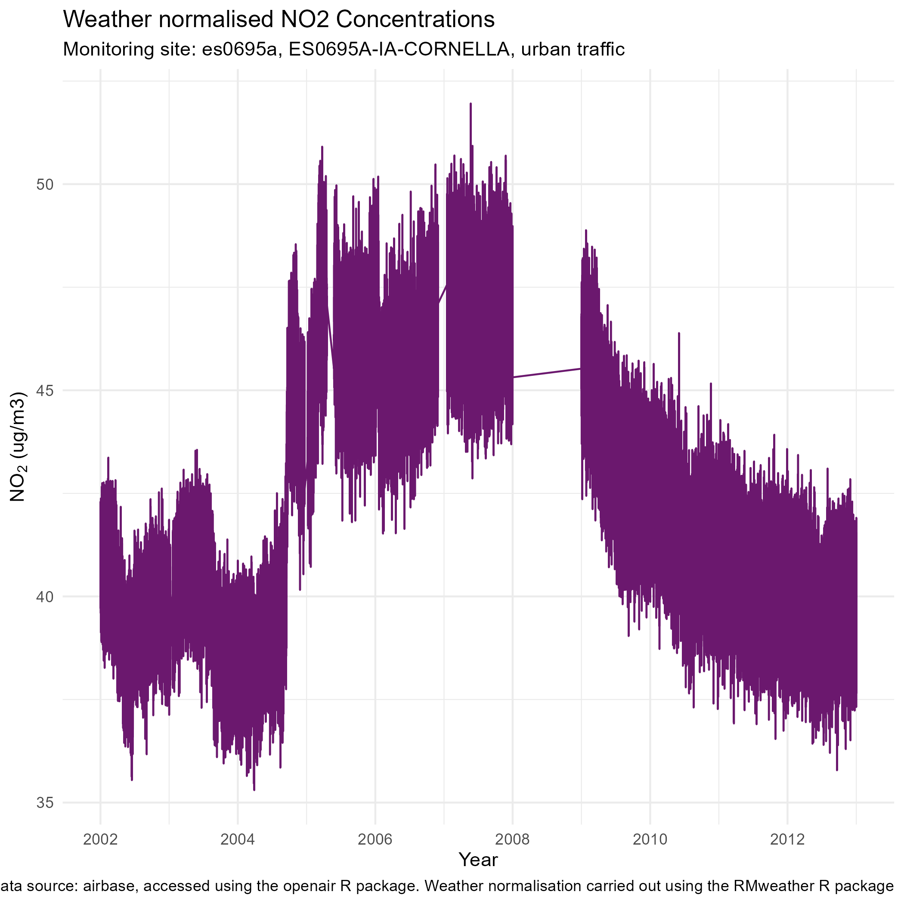

# Cycle Network

The evolution of the Barcelona cycle network,since 2009 according to OSM
data, is shown below. Historic data was obtained using the ohsome R
package and processed with osmactive. Also shown on [an interactive
map](https://blaisekelly.github.io/barcelona_city_dat/maps/osm_cycle_paths.html)

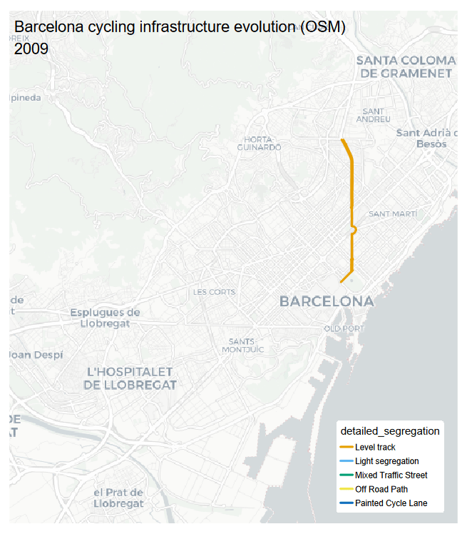
